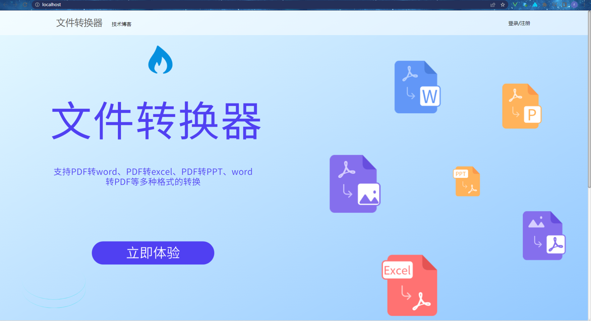
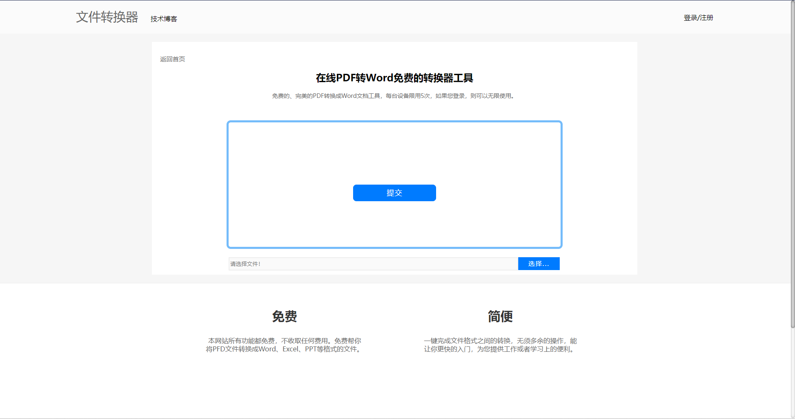
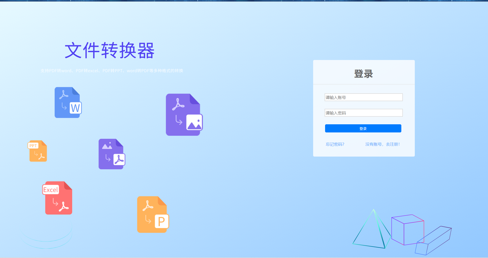

# file-converter
基于vue+springboot实现的文件转换器。支持PDF转Word、PDF转PPT、PDF转Excel等多种格式转换。

## 技术栈及开发工具
- 开发工具：IntelliJ IDEA 2022.2.2、WebStorm 2022.2.2、jdk1.8.0_201
- 技术栈：
  - 后端：springboot、redis、mysql（redis和mysql暂未用到）
  - 前段：vue、element plus
  
## 版本迭代
- 1.0.1 ：完成pdf转word功能。
- 1.0.2 ：完成pdf转ppt和pdf转excel功能。
- 1.0.3 ：修复前端已知的bug，并且优化了前端页面。
- 1.0.4 ：修复前段已知bug，完成登录注册的前端逻辑，后端编写了图片验证码模块。

## 页面效果
### 主页

### 转换页面

### 登录注册页面

### 404页面
